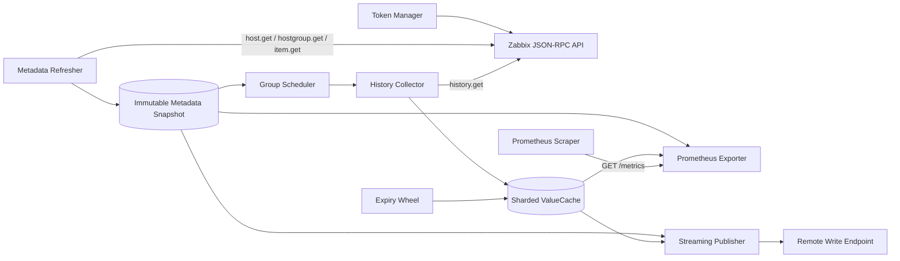

# 架构与数据流 / Architecture and Data Flow

## 目标

Zabbix Exporter 将“向 Zabbix 读取数据”和“向 Prometheus 暴露或推送数据”解耦。Zabbix API 请求只发生在后台 metadata 与 history pipeline；Pull 和 Push 都读取内存快照，因此外部抓取频率不会直接放大 Zabbix API 压力。

## 总体架构

## 启动与关闭

启动顺序：

1. 加载并校验配置。
2. 创建 Zabbix client，启动 API key 或登录 token 管理。
3. 创建 scheduled pipeline。
4. 完成第一次 metadata 刷新；完整快照成功后才继续。
5. 启动 scheduler、expiry wheel，以及可选 Remote Write publisher。
6. 注册指标并启动 HTTP server。

关闭由 SIGINT/SIGTERM 或上层 context 触发。HTTP server、publisher、expiry、scheduler 和 token manager 使用有界 context 停止，避免无限等待。关闭期间 `/ready` 返回非 2xx。

## Metadata 平面

`metadata.Refresher` 低频读取 host 与 item 定义：

- host group/IP/item filter 在 metadata 入口执行；
- `item.get` 只读取定义，不读取当前值；
- host 分批执行 item metadata 查询，并限制并发、超时和最小请求间隔；
- 只有所有批次完整成功并通过一致性检查后，才构建新快照；
- 失败或不完整刷新不会替换最后一个完整快照。

`metadata.Store` 通过原子替换发布不可变快照。每次完整刷新产生 snapshot version；未改变的 host/item/group 保留其 definition version，以便并发采集结果做版本校验。

## 调度与采集平面

Builder 按 `host ID + value type + delay` 形成 collection group。Scheduler 使用：

- 最小堆管理下一次执行时间；
- 固定 worker pool；
- 有界任务队列；
- 启动错峰，避免服务启动瞬间冲击 Zabbix；
- metadata diff 对 group 做增删改对账。

每个 group 再按 `history_batch_size` 切成物理批次，并受全局 `history_query_concurrency` 限制。History 查询带 `time_from`、`time_till`、排序和 limit，使用重叠窗口降低边界丢点风险。

## ValueCache 语义

ValueCache 以 item ID 为键，按固定数量分片并独立加锁。每个 item 仅保留一个标量状态，而不是无界样本切片：

- 值与 Zabbix `clock/ns` 源时间；
- item delay、硬过期时间和有效状态；
- metadata/value version；
- 发布 slot、发布策略和最后确认状态。

应用采集结果时会检查 metadata version。旧定义下完成的并发请求不能覆盖新定义状态。

发布策略按 delay 分为：

- delay ≤ 1 分钟：使用源时间戳，同一个 value version 最多确认发布一次；
- delay > 1 分钟：sample-and-hold，在每个新发布周期使用周期时间戳重复发布，直到硬 TTL。

连续 miss 只有来自完整成功批次时才计数；达到 `miss_threshold` 且超过源时间加宽限后才将旧值置为无效。Expiry wheel 按固定 tick 和单轮工作上限物理删除硬过期状态。

## 输出平面

### Pull

`/metrics` 从一次固定的 metadata snapshot 和 ValueCache 分页读取数据，同时生成 `zabbix_host`。它不调用 Zabbix API，也不修改发布确认状态。

`/internal/metrics` 只使用默认 Prometheus registry，适合独立抓取 exporter 自监控指标。

### Remote Write

Publisher 将完整周期划分为稳定 slot，并将序列稳定映射到 worker lane：

- 分页读取，限制单批样本数和未压缩字节数；
- 单一全局有界逻辑队列，按 lane 保持稳定处理；
- 网络错误、429 和 5xx 使用有界指数退避；
- 成功发送后才对 ValueCache 执行 version-aware ack；
- 新的长周期批次可替换队列中已经过时的同 slot 批次；
- 项目只支持一个 Remote Write endpoint，不实现 HA ownership。

队列满或发送失败不会导致缓存无限增长，但可能造成样本未发布；应通过自监控指标告警。

## 并发与一致性边界

- Metadata snapshot 不可变，通过原子指针读取。
- ValueCache 采用分片锁，不暴露内部可变指针。
- Scheduler 和 publisher 的队列都有明确容量。
- 所有远程调用都由 context 和超时约束。
- Pull 是只读视图；Remote Write ack 只影响发布资格。
- 项目不持久化缓存，重启不会恢复旧 watermark/value state。
- 项目目前不发送 Prometheus stale marker；host/item 删除依赖下游自身的陈旧序列处理。

## 包职责

| 包 | 职责 |
|---|---|
| `cmd/server` | 进程生命周期、HTTP 端点和依赖组装。 |
| `internal/config` | YAML、环境变量展开、默认值和校验。 |
| `internal/zabbix` | JSON-RPC、认证、metadata/history 请求。 |
| `internal/metadata` | 不可变定义快照、diff、标签和 collection group。 |
| `internal/scheduler` | 到期堆、任务队列和 worker pool。 |
| `internal/collector` | history 批次采集与 watermark。 |
| `internal/cache` | 分片 ValueCache、发布状态和 expiry wheel。 |
| `internal/prometheus/exporter` | Prometheus Pull collector。 |
| `internal/promwrap` | Remote Write 编码、队列、worker、重试和 ack。 |
| `internal/metrics` | exporter 自监控指标。 |

## 已知限制

- 只支持数值型 item（Zabbix value type 0 和 3）。
- 只支持一个 Remote Write endpoint。
- HTTP 端点本身不提供 TLS 或认证。
- 配置不支持热重载，修改后需要重启。
- 缓存和 watermark 不持久化。
- 不发送 stale marker。
