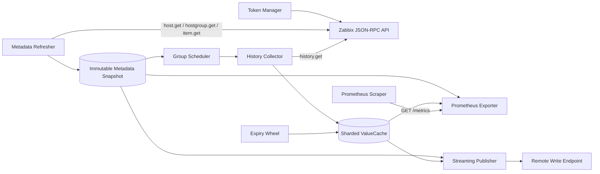

# Architecture and Data Flow

English | [简体中文](architecture_zh-CN.md)

## Goals

Zabbix Exporter separates reading data from Zabbix from exposing or pushing it to Prometheus. Zabbix API requests occur only in the background metadata and history pipelines. Both Pull and Push read in-memory snapshots, so an increased scrape frequency does not directly increase pressure on the Zabbix API.

## System overview

## Startup and shutdown

Startup follows this sequence:

1. Load and validate configuration.
2. Create the Zabbix client and start API-key or login-token management.
3. Create the scheduled collection pipeline.
4. Complete the first metadata refresh; startup continues only after a complete snapshot succeeds.
5. Start the scheduler, expiry wheel, and optional Remote Write publisher.
6. Register metrics and start the HTTP server.

SIGINT, SIGTERM, or cancellation of the parent context starts shutdown. The HTTP server, publisher, expiry wheel, scheduler, and token manager stop through bounded contexts. `/ready` returns a non-2xx response while the service is shutting down.

## Metadata plane

`metadata.Refresher` reads host and item definitions at a relatively low frequency:

- Host-group, host-IP, and item filters run at the metadata boundary.
- `item.get` reads definitions, not current values.
- Item metadata is fetched in host batches with concurrency, timeout, and minimum-request-interval limits.
- A new snapshot is built only after every batch completes successfully and passes consistency checks.
- A failed or incomplete refresh never replaces the last complete snapshot.

`metadata.Store` publishes an immutable snapshot using an atomic replacement. Every complete refresh creates a snapshot version. Unchanged hosts, items, and groups retain their definition versions, allowing concurrently completed collection results to be validated.

## Scheduling and collection plane

The builder creates collection groups by `host ID + value type + delay`. The scheduler uses:

- a min-heap for the next due time;
- a fixed worker pool;
- a bounded task queue;
- startup spreading to avoid a burst against Zabbix;
- metadata diffs to reconcile added, removed, and changed groups.

Each group is split into physical batches using `history_batch_size`, with global concurrency bounded by `history_query_concurrency`. History requests include `time_from`, `time_till`, ordering, and a result limit. An overlapping query window reduces the chance of losing samples at time boundaries.

## ValueCache semantics

ValueCache is keyed by item ID, split across a fixed number of independently locked shards. Each item stores one scalar state rather than an unbounded sample slice:

- value and Zabbix `clock/ns` source time;
- item delay, hard expiry, and validity;
- metadata and value versions;
- publishing slot, publishing policy, and last acknowledgement state.

Applying a collection result checks the metadata version. A concurrent request completed against an old definition cannot overwrite state created for a newer definition.

Publishing behavior depends on item delay:

- Delay ≤ 1 minute: use the source timestamp and acknowledge each value version at most once.
- Delay > 1 minute: use sample-and-hold, republishing during each new cycle with the cycle timestamp until the hard TTL.

Consecutive misses count only for fully successful batches. An old value becomes invalid only after `miss_threshold` is reached and the source-time grace period has elapsed. The expiry wheel physically removes hard-expired state at a fixed tick rate and with a per-run work limit.

## Output plane

### Pull

`/metrics` reads from one fixed metadata snapshot and paginates through ValueCache while also producing `zabbix_host`. It neither calls the Zabbix API nor changes publishing acknowledgement state.

`/internal/metrics` uses only the default Prometheus registry and is suitable for scraping exporter self-monitoring metrics separately.

### Remote Write

The publisher divides a full cycle into stable slots and maps series to stable worker lanes:

- paginated reads bound sample count and uncompressed bytes per batch;
- one global bounded logical queue preserves stable processing by lane;
- network errors, HTTP 429, and HTTP 5xx use bounded exponential backoff;
- ValueCache receives a version-aware acknowledgement only after a successful send;
- a new long-period batch may replace an obsolete queued batch for the same slot;
- only one Remote Write endpoint is supported; HA ownership is not implemented.

A full queue or send failure cannot make the cache grow without bound, but samples may not be published. Alert on the relevant self-monitoring metrics.

## Concurrency and consistency boundaries

- Metadata snapshots are immutable and read through an atomic pointer.
- ValueCache uses sharded locks and never exposes mutable internal pointers.
- Scheduler and publisher queues have explicit capacities.
- Every remote call is bounded by a context and timeout.
- Pull is read-only; Remote Write acknowledgements affect publishing eligibility only.
- Cache and watermark state are not persisted across restarts.
- Prometheus stale markers are not emitted; downstream systems must handle series that disappear after host or item removal.

## Package responsibilities

| Package | Responsibility |
|---|---|
| `cmd/server` | Process lifecycle, HTTP endpoints, and dependency assembly. |
| `internal/config` | YAML parsing, environment expansion, defaults, and validation. |
| `internal/zabbix` | JSON-RPC, authentication, metadata requests, and history requests. |
| `internal/metadata` | Immutable definition snapshots, diffs, labels, and collection groups. |
| `internal/scheduler` | Due-time heap, task queue, and worker pool. |
| `internal/collector` | History batch collection and watermarks. |
| `internal/cache` | Sharded ValueCache, publishing state, and expiry wheel. |
| `internal/prometheus/exporter` | Prometheus Pull collector. |
| `internal/promwrap` | Remote Write encoding, queueing, workers, retries, and acknowledgements. |
| `internal/metrics` | Exporter self-monitoring metrics. |

## Known limitations

- Only numeric items are supported (Zabbix value types 0 and 3).
- Only one Remote Write endpoint is supported.
- HTTP endpoints do not provide built-in TLS or authentication.
- Configuration cannot be reloaded without restarting the process.
- Cache and watermark state are not persistent.
- Stale markers are not emitted.
